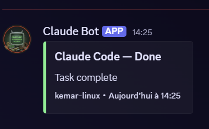

# claude-code-hooks

Claude just rewrote your file. It's broken. You didn't commit.

That's exactly what these hooks prevent.

A collection of ready-to-use hooks for [Claude Code](https://docs.anthropic.com/en/docs/claude-code/hooks). Copy, configure, forget about it.

---

## Available hooks

### 🛡️ auto-backup — saves your files before Claude touches them

Before every `Write` or `Edit`, the original file is copied to `~/.claude/backups/`. Silent. Automatic. You never think about it again.

```
~/.claude/backups/
└── 2026-05-08/
    ├── 143022_app.py       ← the version from before
    └── 143045_models.py
```

Backups are automatically pruned after 7 days.

**Install**

```bash
mkdir -p ~/.claude/hooks
curl -o ~/.claude/hooks/auto-backup.sh \
  https://raw.githubusercontent.com/Joopinhontas/claude-code-hooks/main/hooks/auto-backup.sh
chmod +x ~/.claude/hooks/auto-backup.sh
```

**Add to `~/.claude/settings.json`**

```json
{
  "hooks": {
    "PreToolUse": [
      {
        "matcher": "Write|Edit",
        "hooks": [{ "type": "command", "command": "~/.claude/hooks/auto-backup.sh" }]
      }
    ]
  }
}
```

**Optional env vars**

| Variable | Default | Description |
|---|---|---|
| `CLAUDE_BACKUP_DIR` | `~/.claude/backups` | Backup directory |
| `CLAUDE_BACKUP_RETENTION` | `7` | Days before auto-pruning |

**Restore a file**

```bash
# List all backups
./hooks/restore.sh --list

# Filter by filename
./hooks/restore.sh --list app.py

# Restore (confirmation prompt)
./hooks/restore.sh --restore ~/.claude/backups/2026-05-08/143022_app.py
```

---

### 🚨 dangerous-command-guard — blocks destructive commands before they run

Claude is about to run `rm -rf`. This hook stops it.

Blocked patterns: `rm -rf`, `git reset --hard`, `git push --force`, `DROP TABLE/DATABASE`, `dd if=`, `mkfs`, `chmod -R 777`, fork bomb, and more.

Claude is told why it was blocked and can ask you to confirm before trying again.

**Install**

```bash
curl -o ~/.claude/hooks/dangerous-command-guard.sh \
  https://raw.githubusercontent.com/Joopinhontas/claude-code-hooks/main/hooks/dangerous-command-guard.sh
chmod +x ~/.claude/hooks/dangerous-command-guard.sh
```

**Add to `~/.claude/settings.json`**

```json
{
  "hooks": {
    "PreToolUse": [
      {
        "matcher": "Bash",
        "hooks": [{ "type": "command", "command": "~/.claude/hooks/dangerous-command-guard.sh" }]
      }
    ]
  }
}
```

---

### 🔔 notify — get notified when Claude is done

You kick off a long task. You switch to something else. Claude finishes. You know instantly.

The notification shows which files were edited during the session.

**Two backends, zero required config:**

| Backend | How to activate |
|---|---|
| Desktop (Linux / macOS / Windows) | Automatic when `$DISPLAY` or `$WAYLAND_DISPLAY` is set |
| Discord | Export `CLAUDE_DISCORD_WEBHOOK` in your shell |



**Install**

```bash
curl -o ~/.claude/hooks/notify.sh \
  https://raw.githubusercontent.com/Joopinhontas/claude-code-hooks/main/hooks/notify.sh
chmod +x ~/.claude/hooks/notify.sh
```

**Add to `~/.claude/settings.json`**

```json
{
  "hooks": {
    "Stop": [
      {
        "hooks": [{ "type": "command", "command": "~/.claude/hooks/notify.sh" }]
      }
    ]
  }
}
```

**Discord: 30 seconds to set up**

1. Your Discord server → channel settings → **Integrations** → **Webhooks** → **New Webhook**
2. Copy the URL
3. Add to `~/.bashrc` or `~/.zshrc`:

```bash
export CLAUDE_DISCORD_WEBHOOK="https://discord.com/api/webhooks/..."
```

**Headless Linux:** install `notify-send` if you also want the desktop backend.

```bash
sudo apt install libnotify-bin   # Debian/Ubuntu
sudo dnf install libnotify       # Fedora
```

---

### 📝 git-autocommit — commits your changes automatically after each session

Claude finishes. Changes are staged and committed. Commit message is generated from what you asked and which files were touched.

Opt-in. Doesn't run unless you explicitly enable it.

**Install**

```bash
curl -o ~/.claude/hooks/git-autocommit.sh \
  https://raw.githubusercontent.com/Joopinhontas/claude-code-hooks/main/hooks/git-autocommit.sh
chmod +x ~/.claude/hooks/git-autocommit.sh
```

**Enable**

```bash
# Add to ~/.bashrc or ~/.zshrc
export CLAUDE_AUTO_COMMIT=1
```

**Add to `~/.claude/settings.json`**

```json
{
  "hooks": {
    "Stop": [
      {
        "hooks": [{ "type": "command", "command": "~/.claude/hooks/git-autocommit.sh" }]
      }
    ]
  }
}
```

Only stages files Claude actually touched. Won't commit if nothing changed. Won't run if `CLAUDE_AUTO_COMMIT` is not set.

---

## Install everything at once

```bash
mkdir -p ~/.claude/hooks
for hook in auto-backup dangerous-command-guard notify git-autocommit restore; do
  curl -o ~/.claude/hooks/${hook}.sh \
    https://raw.githubusercontent.com/Joopinhontas/claude-code-hooks/main/hooks/${hook}.sh
done
chmod +x ~/.claude/hooks/*.sh
```

Then copy `examples/settings.json` into `~/.claude/settings.json` and you're done.

---

## How Claude Code hooks work

```
You write a prompt
       ↓
Claude picks a tool (Write, Edit, Bash...)
       ↓
  PreToolUse → your script runs BEFORE the tool   ← auto-backup + guard live here
       ↓
  Claude runs the tool (or gets blocked)
       ↓
  PostToolUse → your script runs AFTER the tool
       ↓
Claude finishes its response
       ↓
  Stop → your script runs when Claude is done      ← notify + git-autocommit live here
```

Each hook receives a JSON payload on `stdin` with the event details (tool name, file path, transcript path...). Read what you need, do what you want, exit.

Full docs: https://docs.anthropic.com/en/docs/claude-code/hooks

---

## Contributing

Got a hook idea? PR with the script in `hooks/` and a section in this README.
